# CSD5004 — Artificial Intelligence and Machine Learning
## Laboratory Record

Ten AI laboratory experiments, implemented in Python and collected into a single executed
Jupyter notebook with full theory, results and discussion for each.

**Anirud Paul** · 26MCF10001 · School of Computing Science Engineering and Artificial
Intelligence, VIT Bhopal University · Fall Semester 2026-27

📊 **[View the results online →](https://anirudpaul.github.io/ai-lab-assignments/)** &nbsp;·&nbsp;
📄 **[Download the PDF](AI_Lab_Assignment.pdf)** &nbsp;·&nbsp;
📓 **[Open the notebook](AI_Lab_Assignment.ipynb)**

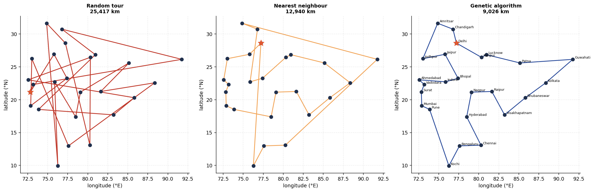

<sub>*Experiment 3 — the same 25 cities under three algorithms. A random tour costs 25,417 km, greedy nearest-neighbour 12,940 km, and the genetic algorithm 9,026 km.*</sub>

---

## The experiments

| # | Experiment | Approach | Headline result |
|---|---|---|---|
| 1 | DFS and BFS graph traversal | Adjacency-list graph, both traversals from scratch | BFS found the 2-edge path to the goal; DFS took 5. BFS peak memory 93–216× DFS on balanced trees |
| 2 | 8-puzzle solver | A\* with 4 heuristics | All heuristics returned the same 12-move optimum; nodes expanded fell 1,453 → 15 (97×) |
| 3 | Travelling salesman | Genetic algorithm (OX crossover, inversion mutation) | 9,026 km vs 12,940 km greedy and 9,192 km for 2-opt; beat 2-opt in 5 of 6 seeds |
| 4 | FOIL rule induction | Sequential covering on information gain | `grandfather`, `grandmother`, `sibling` learned at precision & recall 1.0 |
| 5 | Expert system | Forward chaining + certainty factors | 20 rules, 3 inference layers, full how/why explanation |
| 6 | MNIST digit classifier | Multilayer perceptron (PyTorch) | **98.18 %** test accuracy; identical net without activations gets 91.28 % |
| 7 | LFW face recognition | PCA eigenfaces + RBF SVM | **84.78 %** accuracy / 81.48 % balanced, vs 41.15 % majority baseline |
| 8 | MNIST clustering | K-Means from scratch (k-means++) | Purity 0.587, ARI 0.365 — but two digits went unclaimed and two were split |
| 9 | CIFAR-10 classification | Convolutional neural network | **86.87 %**, vs 54.69 % for an MLP given 4.7× more parameters |
| 10 | IMDB sentiment analysis | 2-layer bidirectional LSTM | **86.40 %** (AUC 0.9416) — but a TF-IDF bigram baseline beat every RNN at 90.32 %, in 35 s of CPU vs 955 s of GPU |

Every experiment is written up with **Aim → Theory → Implementation → Results →
Discussion**, and every claim in a discussion section is supported by output printed in
the notebook. Where a result contradicted the expected textbook outcome — augmentation
not improving CIFAR-10 accuracy, greedy FOIL failing on `uncle`, the elbow method failing
to identify k=10 — it is reported as it happened rather than smoothed over.

---

## A look inside

Every figure below is generated by the notebook itself — all 43 are in
[`assets/fig/`](assets/fig/), and the [live site](https://anirudpaul.github.io/ai-lab-assignments/)
shows them alongside the code that produced them.

<table>
<tr>
<td width="50%" valign="top">
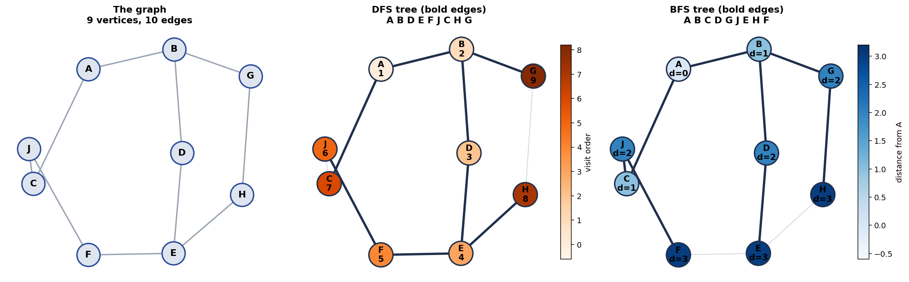
<sub><b>1 · Graph traversal.</b> The same graph under DFS and BFS. Bold edges are the search tree; DFS dives down one branch, BFS fans out level by level.</sub>
</td>
<td width="50%" valign="top">
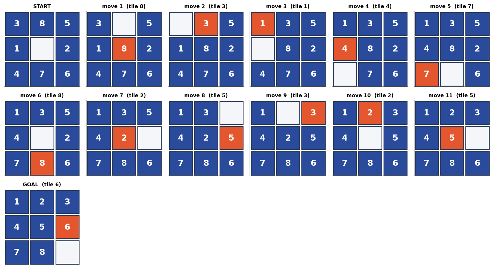
<sub><b>2 · 8-puzzle.</b> The full 12-move optimal solution found by A*, with the tile that slid highlighted at each step.</sub>
</td>
</tr>
<tr>
<td width="50%" valign="top">
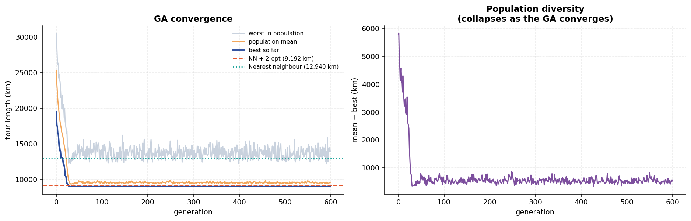
<sub><b>3 · Evolutionary search.</b> The population converging over 600 generations, against the nearest-neighbour and 2-opt baselines.</sub>
</td>
<td width="50%" valign="top">
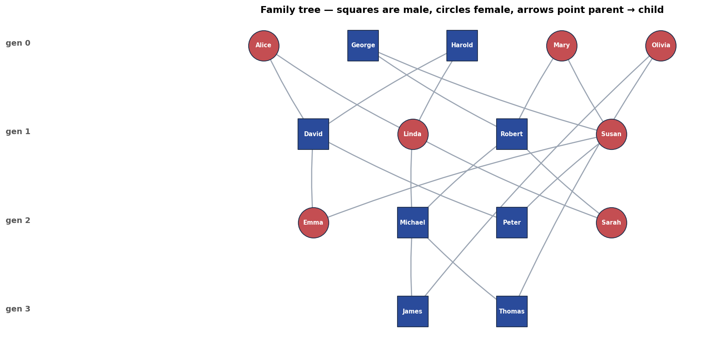
<sub><b>4 · FOIL.</b> The family tree the learner induces rules from — squares male, circles female, arrows parent → child.</sub>
</td>
</tr>
<tr>
<td width="50%" valign="top">
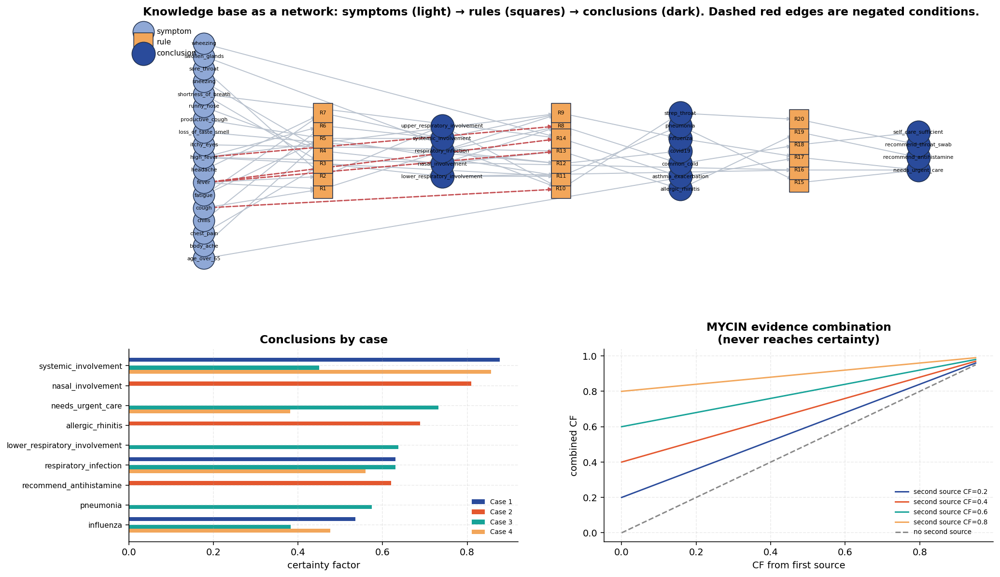
<sub><b>5 · Expert system.</b> The knowledge base as a network: symptoms → rules → diagnoses. Dashed red edges are negated conditions.</sub>
</td>
<td width="50%" valign="top">
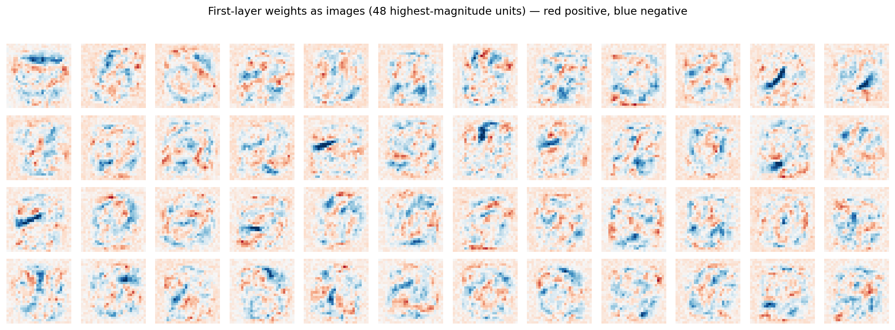
<sub><b>6 · MLP on MNIST.</b> First-layer weights reshaped to 28×28. The network learned stroke and blob detectors, not digit templates.</sub>
</td>
</tr>
<tr>
<td width="50%" valign="top">
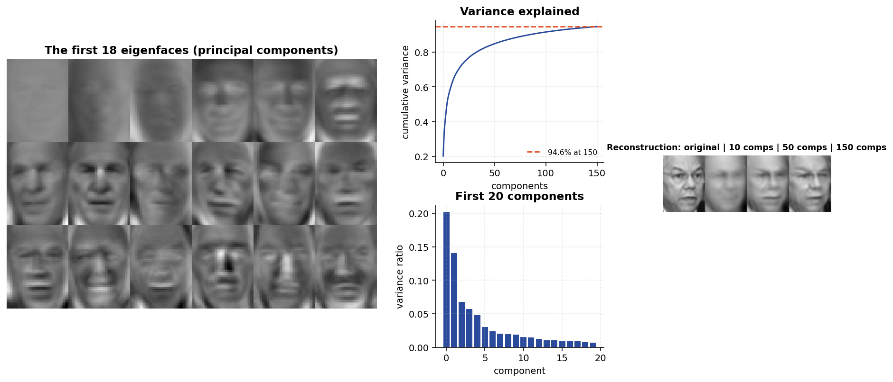
<sub><b>7 · Eigenfaces.</b> The first 18 principal components of the LFW faces, and what a face looks like rebuilt from 10, 50 and 150 of them.</sub>
</td>
<td width="50%" valign="top">
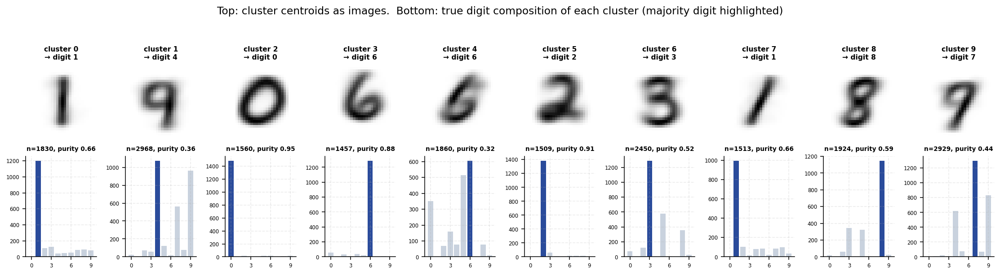
<sub><b>8 · K-Means.</b> Each cluster centroid as an image, with the true digit composition underneath — two digits were never claimed.</sub>
</td>
</tr>
<tr>
<td width="50%" valign="top">
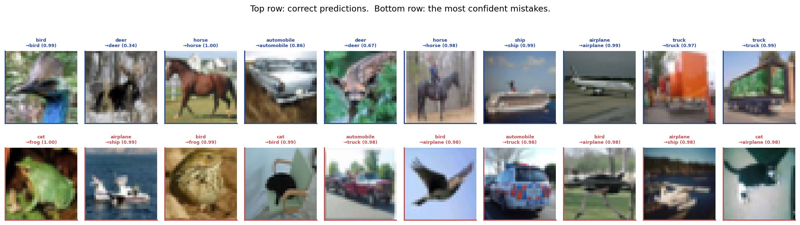
<sub><b>9 · CNN on CIFAR-10.</b> Correct predictions in blue, the most confident mistakes in red — mostly cat/dog and bird/airplane.</sub>
</td>
<td width="50%" valign="top">
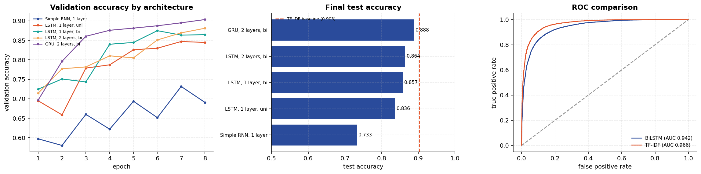
<sub><b>10 · Sentiment analysis.</b> Five recurrent architectures against a TF-IDF bigram baseline — which beat all of them.</sub>
</td>
</tr>
</table>

## Repository layout

```
├── AI_Lab_Assignment.ipynb    the submitted notebook (executed, with all outputs)
├── AI_Lab_Assignment.pdf      the same record as a PDF
├── AI_Lab_Assignment.docx     the same record as a Word file (page borders + header)
├── src/                       cell-marked sources, one file per experiment
│   ├── 00_title.py            title page, index, shared setup
│   ├── 01_dfs_bfs.py
│   │   ...
│   └── 10_rnn_imdb_sentiment.py
├── tools/
│   ├── fetch_data.py          downloads and normalises all four datasets
│   ├── nbbuild.py             src/*.py -> notebook -> execute -> HTML + PDF
│   ├── build_site.py          generates the GitHub Pages site
│   ├── build_docx.py          notebook -> Word, with page borders and course header
│   ├── refresh_markdown.py    updates prose without discarding executed output
│   ├── verify_claims.py       pulls headline numbers out of the executed notebook
│   └── smoke.py               fast runtime check for a single experiment
├── assets/
│   ├── vit_logo.png
│   └── fig/                   every figure, as PNG
└── docs/                      GitHub Pages site
```

The notebook is **generated**, not hand-edited. Each experiment lives in `src/NN_name.py`
using `# %%` / `# %% [markdown]` cell markers; `tools/nbbuild.py` assembles them into one
notebook, executes it, and exports HTML and PDF. This keeps a 10-experiment record
editable one experiment at a time instead of as a single multi-megabyte JSON blob.

## Reproducing

```bash
pip install -r requirements.txt
python tools/fetch_data.py        # ~500 MB: MNIST, CIFAR-10, IMDB, LFW
python tools/nbbuild.py all       # assemble, execute, export
```

Datasets are fetched once into `data/` (git-ignored) and cached as `.npz`, so the notebook
itself makes no network calls and re-runs identically.

To check a single experiment quickly while editing it:

```bash
python tools/smoke.py 04_foil_family_tree.py
```

### Environment

Produced on Python 3.11.0, Windows 11, with an NVIDIA RTX 4060 (CUDA 12.1). Everything
runs on CPU as well — experiments 6, 9 and 10 are simply slower. `SEED = 42` is fixed
throughout and cuDNN is put in deterministic mode, so repeated runs reproduce the numbers
quoted in the discussion sections.

> **Note on datasets.** The canonical hosts for CIFAR-10 and MNIST measured at
> 0.01–0.04 MB/s from the machine this was built on, which would have made CIFAR-10 alone
> a ~4.7 hour download. `tools/fetch_data.py` pulls byte-identical data from the
> HuggingFace CDN at ~1 MB/s instead. LFW still comes through scikit-learn's own fetcher.

## Licence

Coursework, shared for reference. The datasets belong to their respective publishers.
